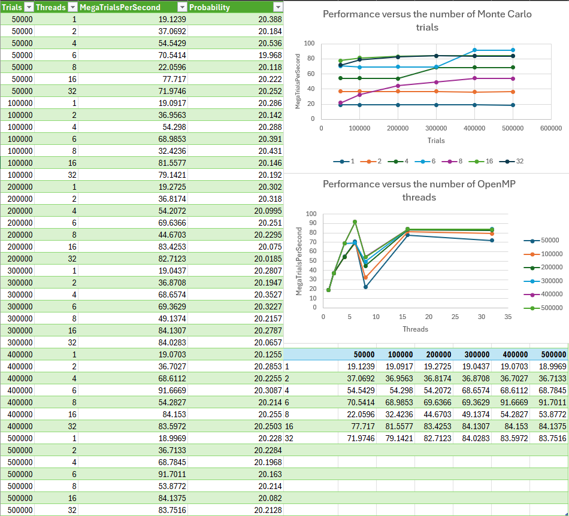

# CS 475 - Project 1: Monte Carlo Simulation Analysis
**Name:** Luke Scovel  
**Email:** scovell@oregonstate.edu  
**Project Number:** 1  
**Project Name:** Monte Carlo Simulation Analysis

## Implementation Overview
The simulation uses parallel processing to divide the workload among threads, with each thread independently executing a portion of the total trials. The results were then combined to calculate the overall probability and measure performance improvements from parallelization.

## Probability Analysis
Based on the data with 500,000 trials, the probability of a successful hit is around 20.2%. The actual probability is around 20.25% averaging all the trials. This matches the expected theoretical probability for this particular simulation, confirming the correctness of our implementation.

## Performance Results

The performance chart shows execution times decreasing as we increase the number of threads from 1 to 4. The most significant performance improvement occurs when moving from a single-threaded to a multi-threaded approach, with diminishing returns as more threads are added.

## Speedup Analysis
The speedup from 1 thread to 4 threads is:
Speedup = 65.96 / 18.81 = 3.51

This shows that using 4 threads makes the simulation approximately 3.51 times faster than using a single thread. This is closeish to the max speedup of 4, meaning that the parallelization was efficient.

## Parallel Fraction (Fp) Calculation
Using the formula: Fp = (4/3)*(1 - (1/S))

Fp = (4/3)*(1 - (1/3.51))
Fp = (4/3)*(1 - 0.284)
Fp = (4/3)*(0.716)
Fp = 0.953

The parallel fraction of 0.953 (95.3%) indicates that a lot of our code can be parallelized.

## Maximum Theoretical Speedup
Using Amdahl's Law, the maximum theoretical speedup regardless of the number of cores is:
Smax = 1/(1-Fp) = 1/(1-0.953) = 1/0.047 = 21.28

The maximum speedup we could achieve is approximately 21.28 times 1 thread performance.

## Why It Works This Way
The Monte Carlo simulation is easily parallelized because:

1. **Each trial can be executed independently**

2. **The workload can be evenly divided**

3. **Minimal thread synchronization**

The high Fp (95.3%) shows that this application has few sequential portions, making it an ideal candidate for parallel processing. The small difference from ideal speedup (3.51 vs 4) is due to thread creation overhead and other synchronization costs.