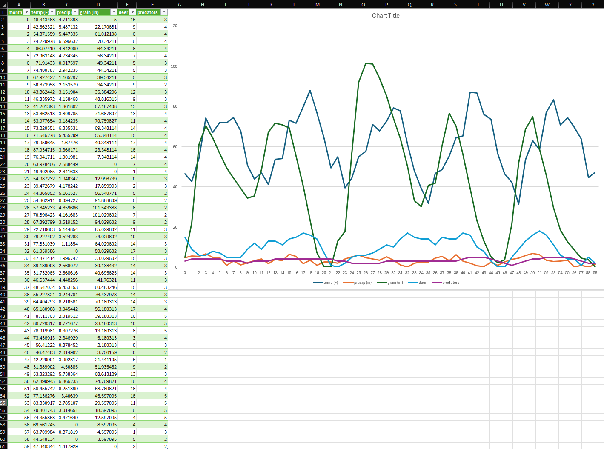

# CS 475 - Project 2: Functional Decomposition
**Name:** Luke Scovel  
**Email:** scovell@oregonstate.edu  
**Project Number:** 2  
**Project Name:** Functional Decomposition

## Own-Choice Quantity: Predator Population

For my own-choice quantity, I implemented predators in the ecosystem.

1. Each predator eats approximately 1 deer per month
2. Predator population growth depends on the deer-to-predator ratio:
   - If the ratio is <= 4.0 (abundant food), the predator population increases by 0-2
   - If the ratio is >= 2.0 (sufficient food), the predator population changes by -1 to +1
   - If the ratio is < 2.0 (scarce food), the predator population decreases by 0-2

The predator population fits into the simulation by creating a balancer for the deer population.

## Simulation Data

## Commentary on Results

The simulation shows that the deer population would decimate the grain population if the deer population was not kept in check. Whenever the deer population was low, the height of the grain population increased rapidly which allowed for more deer to survive. The predator population was more stable since there were fewer of them. The temperature and rainfall had more random curves to introduce noise into the simulation.

Whenever the deer population increased, the predator population increased as well. This would then result in a decrease in the deer population. This showed that my quatity was affecting the simulation correctly.