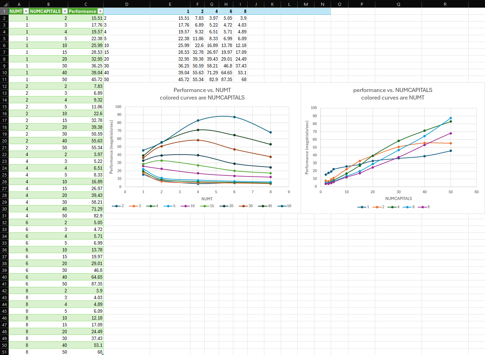

# CS 475 - Project 3: K-means: A Real Application Parallel Challenge
**Name:** Luke Scovel  
**Email:** scovell@oregonstate.edu  
**Project Number:** 3
**Project Name:** K-means: A Real Application Parallel Challenge

## Machine Information
* rabbit.engr.oregonstate.edu
* CentOS Linux release 7.9.2009 (Core)
* g++ compiler

## Performance Data

## Analysis
