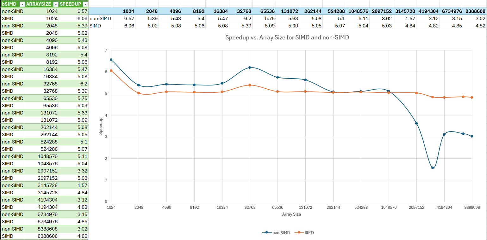

# CS 475 - Project 4: Vectorized Array Multiplication and Multiplication/Reduction using SSE
**Name:** Luke Scovel  
**Email:** scovell@oregonstate.edu  
**Project Number:** 4  
**Project Name:** Vectorized Array Multiplication and Multiplication/Reduction using SSE

## Machine Information
* rabbit.engr.oregonstate.edu
* CentOS Linux release 7.9.2009 (Core)
* g++ compiler

## Performance Data

## Performance Analysis

* What patterns are you seeing in the speedups?

The speedups generally average around 5x, with the non-SIMD code being about .25 higher until it hits the L2 cache size (65536 * 4 bytes/float = 262144 bytes, 256 KB). After that, the speed up is about the same for both until it hits 1048576 bytes (1 MB), where the non-SIMD code starts to slow down faster than the SIMD code, averaging around 3x speedup while SIMD stays around 4.5-5x.

* Are they consistent across a variety of array sizes?

* Why or why not, do you think? 