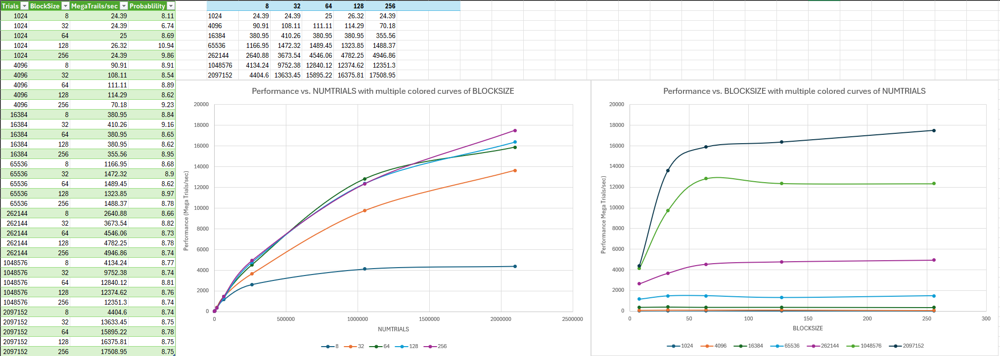

# CS 475 - Project 5: CUDA: Monte Carlo Simulation
**Name:** Luke Scovel  
**Email:** scovell@oregonstate.edu  
**Project Number:** 5  
**Project Name:** CUDA: Monte Carlo Simulation  
**Machine:** `submit-b.hpc.engr.oregonstate.edu`

## Performance Analysis

### Performance Data

### Probability Analysis
The average probability of hitting the castle in this simulation is approximately 8.75% due to the different random paramaters.

### Performance Patterns

1. As the number of trials increases, the MegaTrials/Second also increases substantially, from ~25 MT/s at 1,024 trials to ~17,500 MT/s at 2,097,152 trials. This shows that the GPU becomes more efficient when processing larger workloads.

2. Larger block sizes perform better than smaller ones as the problem size increases. At the largest trial size (2,097,152), performance ranges from 4,404 MT/s with block size 8 to 17,508 MT/s with block size 256.

3. The performance improvement from increasing block size becomes less significant at extremely large trial size since the GPU hits a limit at hoe much more it can process in parallel and threads are in groups of 32.

### Why Block Size 8 Is Worse

1. CUDA GPUs put threads into groups of 32, leading to wasted computational resources.

2. Small block sizes result in more blocks but don't efficiently utilize the GPU's thread-level parallelism capabilities.

3. There's a fixed overhead associated with launching blocks. With many small blocks, this overhead becomes significant compared to the actual computation time.

### Vs. Project #1

In Project #1, the best performance achieved was approximately 84-91 MegaTrials/Second. This CUDA implementation reaches over 17,500 MegaTrials/Second, a massive improvement in performance due to the incredible number of cores a GPU has, their efficiency at calculations, memory bandwidth, and simply the fact that they are design for parallel processing.

### What you can do with GPU parallel computing

1. Monte Carlo and other similar scenarios are ideal for GPU acceleration due to their parallel nature.
2. GPUs excel at problems that can be divided into thousands or millions of independent tasks.
3. GPUs can provide massively better performance than CPUs for certain types of calculations, especially those involving large datasets.