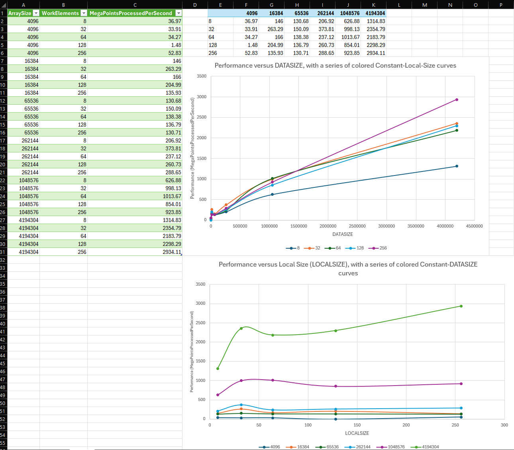

# CS 475 - Project 6: OpenCL Quadratic Regression
**Name:** Luke Scovel  
**Email:** scovell@oregonstate.edu  
**Project Number:** 6  
**Project Name:** OpenCL Quadratic Regression  
**Machine:** `rabbit.engr.oregonstate.edu`

## Performance Analysis

### Performance Data

### Performance Patterns and Observations

Performance seems to peak at 32 Work Elements until 256 Work Elements, where it goes up again. Performance also increases as the Data Size increases because the GPU is able to handle larger data sets more efficiently due to less relative overhead. The patterns look like this because 32 Work Elements is the optimal number for the GPU to handle until 256, and the GPU can process larger data sets more efficiently due to its parallel processing capabilities.

### Calculated Values
- **Q:** [1.5]
- **L:** [3.5] 
- **C:** [9.0]