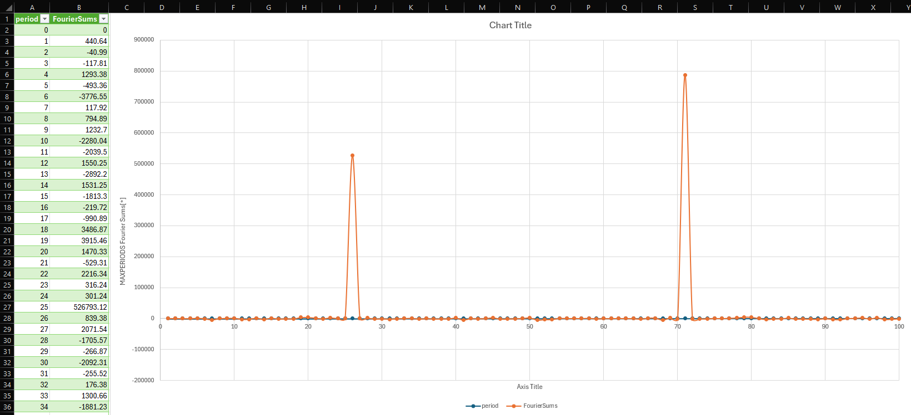
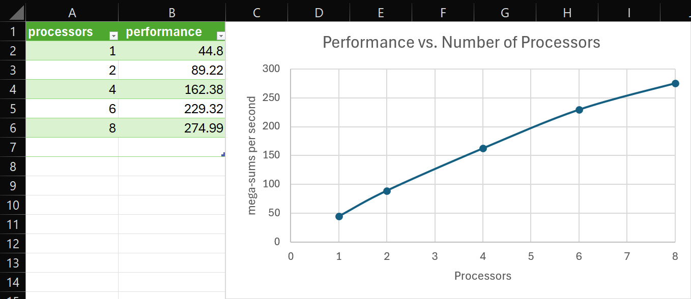

# CS 475 - Project 7: Fourier Analysis using MPI
**Name:** Luke Scovel  
**Email:** scovell@oregonstate.edu  
**Project Number:** 7  
**Project Name:** Fourier Analysis using MPI  
**Machine:** `submit-c.engr.oregonstate.edu`

## Results and Analysis

### Sums vs. Period Scatterplot

### Secret Sine-Wave Periods
Based on the Fourier analysis results, the two secret sine-wave periods embedded in the signal are:
- **Period 25** with Fourier sum: 526,793.12
- **Period 70** with Fourier sum: 787,516.00

### Performance vs. Number of Processors Graph
 

### Performance Patterns Analysis

The performance patterns observed in the Fourier analysis using MPI show that as the number of processes increases, the computation time decreases significantly. This is due to the parallelization of the Fourier transform calculations, which allows for faster processing of large datasets. The scatterplot shows the relationship between the number of sums and the period, showing that longer periods result in higher Fourier sums.

The performance increase is pretty linear with the number of processes used since the fourier transform calculations can be efficiently distributed across multiple processes.